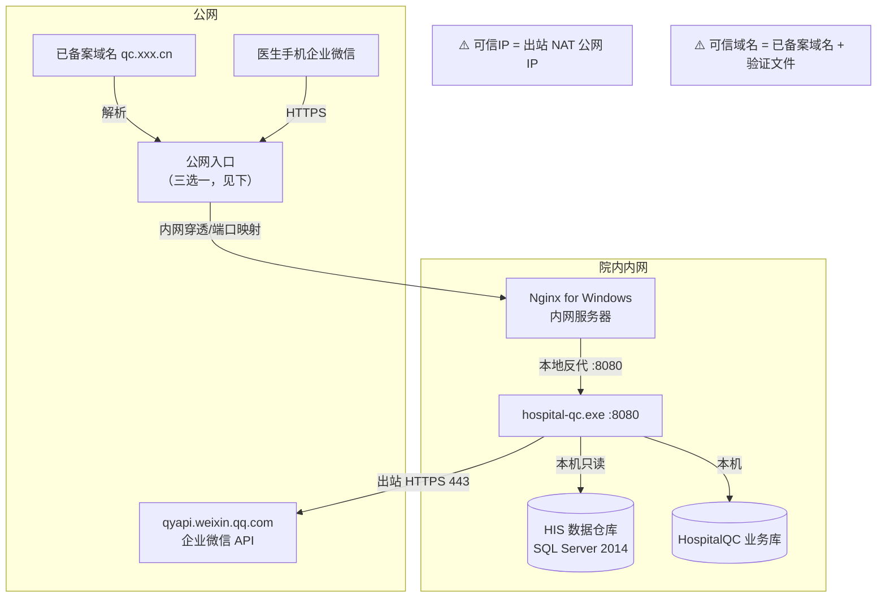

<!--
  文档名称：内网部署与企微配置方案
  版本：V1.0
  日期：2026-08-03
  适用范围：院方服务器位于内网（无公网 IP / 经 NAT 出网）时的部署与企微后台配置
  状态：方案确认中（网络出口与公网入口方式需院方信息科确认）
-->

# 内网部署与企微配置方案

> 背景：医院服务器部署在内网（与数据库同机），医生通过手机企业微信访问 H5 报告页。
> 本方案解决两个核心问题：**① 企微后台可信IP/可信域名怎么配；② 内网环境下 H5 如何被手机访问、Nginx 如何配置。**

---

## 一、网络拓扑（内网 + 公网入口）



**公网入口三选一（H5 被手机访问的前提）：**

| 方案 | 说明 | 优点 | 缺点 | 适用 |
|------|------|------|------|------|
| **A 公网端口映射** | 医院公网 IP 将 443 映射到内网服务器 | 无额外成本 | 需医院提供公网 IP + 防火墙映射 | 医院有公网 IP |
| **B 云服务器反代（推荐）** | 一台已备案域名的云服务器（如阿里云/腾讯云轻量）Nginx 反代，经 FRP/NPS 隧道转发到内网服务器 | 部署灵活、内网零暴露、域名/证书都在云上 | 需云服务器费用 | 无公网 IP 的常规场景 |
| **C 专线/VPN** | 通过专线或 VPN 打通云服务器与内网 | 稳定 | 依赖网络建设 | 已有专线的医院 |

> **结论：** 医院无公网 IP 时推荐**方案 B**（云服务器 + FRP/NPS 内网穿透）。

---

## 二、企微后台配置顺序（**不可颠倒**，2026-08-03 确认）

> **关键前置：** 企业微信应用**添加「企业可信IP」的前提是必须先添加「可信域名」**并完成归属验证。

| 步骤 | 操作 | 位置 | 前置 | 说明 |
|------|------|------|------|------|
| ① | **域名备案** | 工信部备案（或使用已有备案域名） | 无 | 准备 `qc.xxx.cn`（H5 用）、`api.xxx.cn`（API 用，可同一域名） |
| ② | **添加可信域名** | 企微后台 → 应用管理 → 应用 → **网页授权及JS-SDK → 可信域名** | ① | 下载验证文件 `WW_verify_xxxx.txt`，放到**公网入口**可 HTTPS 访问的域名根目录 → 点验证 |
| ③ | **添加企业可信IP** | 企微后台 → 应用管理 → 应用 → **企业可信IP** | ② | 填**部署服务器访问企微 API 的出站公网 IP**（内网环境 = NAT 出口公网 IP，需信息科确认；不是内网 IP） |
| ④ | **通讯录权限**（可选） | 应用 → 权限 → 通讯录 | ③ | 「通讯录-读取成员」或通讯录同步 secret，用于直拉医生映射 |
| ⑤ | **回调/接收消息**（如需） | 应用 → 接收消息 | ②③ | 回调 URL 需公网可达，暂未启用 |

> **验证文件放置位置：** 必须是**公网可访问**的域名根路径（`https://qc.xxx.cn/WW_verify_xxxx.txt` 返回 200），因此方案 A/B 都需先把公网入口 + Nginx 就绪再验证。

---

## 三、Nginx 配置（分场景）

### 3.1 通用配置（内网服务器本地，方案 A 或作为隧道内层）

```nginx
# 与现有 deploy/nginx.conf 一致：api 反代 + h5 静态
server {
    listen       443 ssl;
    server_name  qc.xxx.cn;          # 已备案域名（可信域名）

    ssl_certificate      D:/app/hospital-qc/ssl/qc.xxx.cn.pem;
    ssl_certificate_key  D:/app/hospital-qc/ssl/qc.xxx.cn.key;
    ssl_protocols        TLSv1.2 TLSv1.3;

    # ★ 可信域名验证文件（必须放公网可达的根路径）
    location = /WW_verify_xxxx.txt {
        root   D:/app/hospital-qc/verify;   # 放置验证文件的目录
        access_log off;
    }

    # API 反代
    location /api/ {
        proxy_pass http://127.0.0.1:8080;
        proxy_set_header Host $host;
        proxy_set_header X-Real-IP $remote_addr;
        proxy_set_header X-Forwarded-For $proxy_add_x_forwarded_for;
    }

    # H5 静态资源
    location / {
        root   D:/app/hospital-qc/frontend/dist;
        index  index.html;
        try_files $uri $uri/ /index.html;
    }
}
```

### 3.2 方案 B：云服务器反代（公网入口层）

云服务器 Nginx 只做 HTTPS 终结 + 反代到 FRP/NPS 隧道端口（内网服务器跑 frpc 客户端）：

```nginx
server {
    listen       443 ssl;
    server_name  qc.xxx.cn;
    ssl_certificate      /etc/nginx/ssl/qc.xxx.cn.pem;
    ssl_certificate_key  /etc/nginx/ssl/qc.xxx.cn.key;

    # 可信域名验证文件（放云服务器上即可）
    location = /WW_verify_xxxx.txt {
        root /var/www/verify;
        access_log off;
    }

    location / {
        proxy_pass http://127.0.0.1:7000;   # FRP/NPS 隧道映射端口
        proxy_set_header Host $host;
        proxy_set_header X-Real-IP $remote_addr;
        proxy_set_header X-Forwarded-For $proxy_add_x_forwarded_for;
        proxy_http_version 1.1;
        proxy_set_header Upgrade $http_upgrade;
        proxy_set_header Connection "upgrade";
    }
}
```

内网服务器 frpc 配置示例（`frpc.ini`）：

```ini
[common]
server_addr = 云服务器公网IP
server_port = 7000

[qc-h5]
type = http
local_ip = 127.0.0.1
local_port = 443        # 内网服务器 Nginx 443（或 8080）
custom_domains = qc.xxx.cn
```

### 3.3 关键 Nginx 要点

| 要点 | 说明 |
|------|------|
| 可信域名验证文件 | `location = /WW_verify_xxx.txt` 必须 200 且为**根路径** |
| HTTPS | WeCom 强制 HTTPS；证书须与可信域名一致（Let's Encrypt 或云厂商证书均可） |
| H5 与 API 分离 | H5 静态 `frontend/dist`；API 反代 `127.0.0.1:8080` |
| 出站 | 内网服务器仅需**出站 443** 到 `qyapi.weixin.qq.com`（防火墙放行） |
| 心跳/隧道 | 方案 B 用 FRP/NPS 时，隧道进程注册为 Windows 服务（NSSM）开机自启 |

---

## 四、防火墙与网络要求清单（交信息科）

- [ ] **出站**：内网服务器允许访问 `qyapi.weixin.qq.com:443`（HTTPS 出站）
- [ ] **出站公网 IP 确认**：内网服务器经 NAT 出网的公网 IP（用于企微「企业可信IP」；可用 `curl ifconfig.me` 或信息科查询）
- [ ] **入站（方案 A）**：医院防火墙将公网 IP 的 443 映射到内网服务器
- [ ] **入站（方案 B）**：云服务器安全组放行 443（HTTPS）与 7000（FRP 控制端口）
- [ ] **DNS**：`qc.xxx.cn` 解析到公网入口 IP
- [ ] **证书**：`qc.xxx.cn` 的 SSL 证书（云厂商免费证书或 Let's Encrypt）

---

## 五、实施步骤（含检查点）

| 步骤 | 动作 | 负责 | 检查点 |
|------|------|------|--------|
| 1 | 确认网络出口与公网入口方案（A/B/C） | 信息科 | 出站公网 IP 确认 |
| 2 | 域名备案或确认使用已有备案域名 | PM/院方 | ICP 备案号 |
| 3 | 部署 Nginx + 后端到内网服务器，本地 `https://127.0.0.1/api/v1/health` 通 | 后端 | health 200 |
| 4 | 公网入口就绪（映射或云服务器+隧道），外网访问 `https://qc.xxx.cn` 通 | 后端+信息科 | 手机流量访问 200 |
| 5 | 企微后台：添加可信域名 + 放验证文件 + 验证通过 | 企微管理员 | 验证成功 |
| 6 | 企微后台：添加企业可信IP（NAT 出口公网 IP） | 企微管理员 | 保存成功 |
| 7 | 服务器复测 `go run ./cmd/weworkcontact` 拉取通讯录 | 后端 | 不再 60020 |
| 8 | 医生映射写入 + 真机推送联调（卡片 → H5） | 后端 | 手机收到卡片并打开 H5 |
| 9 | 灰度推送（1 科室 20% 医生）→ 全量 | 后端+质控科 | 推送成功率 |

---

## 六、风险与替代

| 风险 | 影响 | 应对/替代 |
|------|------|----------|
| 医院无公网入口且不允许云服务器 | H5 手机无法访问 | 降级为**纯文本/摘要通知**（markdown 消息不依赖 H5），医生内网 PC 访问 H5；或企业微信「应用消息→跳转」改内网 Web 应用 |
| 出站公网 IP 变化（运营商 NAT） | 可信IP失效 | 确认医院是否为固定公网 IP；动态 IP 需企微侧周期性更新可信IP（R09 跟踪） |
| 域名备案周期长 | 阻塞可信域名/可信IP | 先用已有备案域名子域（如 `qc.医院主域名.cn`）；备案期间用云服务器临时域名联调（不配置可信域名） |
| 防火墙拦截出站 | 无法调企微 API | 信息科放行 `qyapi.weixin.qq.com` 出站 443；必要时按企微官方 IP 段放行 |

---

> **维护说明：** 本方案与 `deploy/nginx.conf`、交接文档 M7 章节保持一致；网络环境确认后更新方案状态与具体 IP/域名。
