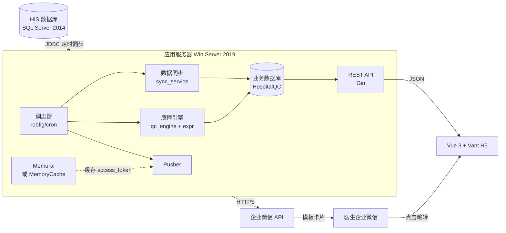
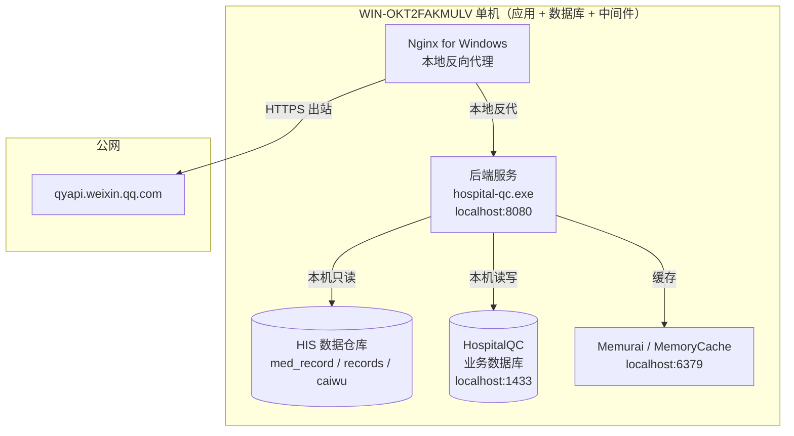
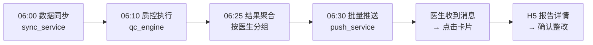
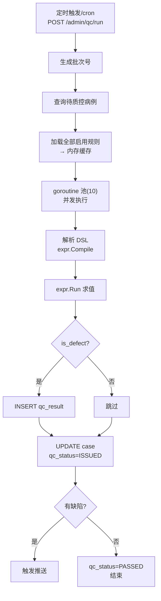
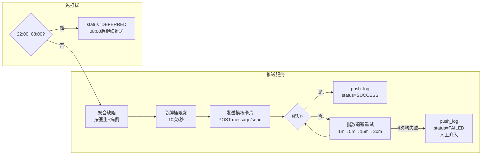
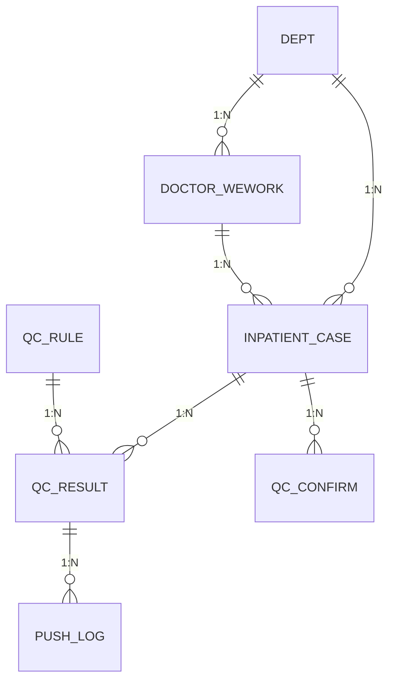
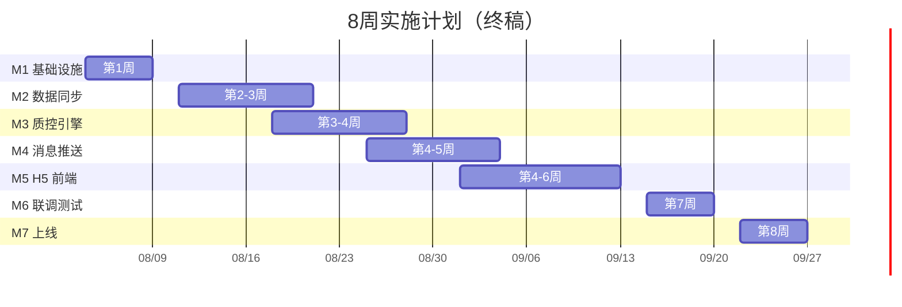

<!--
  文档名称：住院病例质控企业微信推送系统 - 技术方案终稿
  版本：V1.1（终稿）
  日期：2026-07-31
  前置阅读：PM决策备忘录-技术方案对齐.md
  状态：✅ 已对齐，可进入实施
-->

# 住院病例质控企业微信推送系统 — 技术方案终稿

> 本文档为 PM 决策对齐后的技术方案终稿。所有与决策不一致的历史残留均已修正。

---

## 一、技术栈（最终确认）

| 层级 | 选型 | 版本 | 决策来源 |
|------|------|------|---------|
| **后端语言** | Go | 1.22+ | PM 决策 1 |
| **Web 框架** | Gin | v1.10+ | 连带决策 |
| **数据库** | SQL Server 2014 | 院方现有 | 方案一致 |
| **数据库驱动** | go-mssqldb + sqlx | - | 连带决策 |
| **缓存** | Memurai / 进程内 MemoryCache | - | PM 决策 2 |
| **规则引擎** | expr-lang/expr | v1 | PM 决策 4 |
| **任务调度** | robfig/cron | v3 | PM 决策 3 |
| **JWT** | golang-jwt/jwt | v5 | 连带决策 |
| **日志** | zerolog | v1 | 连带决策 |
| **前端** | Vue 3 + Vant 4 + Vite | 最新 | 方案一致 |
| **部署** | Windows Service (NSSM) + Nginx for Windows | - | PM 决策 2 |

> **以上技术栈已全部对齐，不再存在 Go/Java/C# 多选一的情况。**

---

## 二、系统架构

### 2.1 总体架构



### 2.2 网络拓扑（单机部署）

> **院方要求（2026-07-31）：** 项目部署到和数据库同一个服务器上。
> 应用服务器 = 数据库服务器 = 服务器实例 `WIN-OKT2FAKMULV\SQLEXPRESS`。



---

## 三、项目结构（最终版）

```
hospital-qc-wework/
├── backend/                          # Go 后端
│   ├── cmd/server/main.go            # 入口
│   ├── internal/
│   │   ├── config/                   # 配置管理
│   │   ├── model/                    # 数据模型
│   │   │   ├── inpatient_case.go
│   │   │   ├── qc_rule.go
│   │   │   ├── qc_result.go
│   │   │   ├── doctor_wework.go
│   │   │   ├── push_log.go
│   │   │   └── department.go
│   │   ├── dao/                      # 数据库访问层
│   │   │   ├── db.go
│   │   │   ├── case_dao.go
│   │   │   ├── rule_dao.go
│   │   │   ├── result_dao.go
│   │   │   ├── doctor_dao.go
│   │   │   └── push_log_dao.go
│   │   ├── middleware/               # HTTP 中间件
│   │   │   ├── auth.go
│   │   │   ├── logger.go
│   │   │   └── recovery.go
│   │   ├── handler/                  # HTTP 处理器
│   │   │   ├── routes.go
│   │   │   ├── report_handler.go
│   │   │   ├── doctor_handler.go
│   │   │   └── admin_handler.go
│   │   └── service/                  # 业务逻辑
│   │       ├── sync/                 # 数据同步
│   │       ├── qc/
│   │       │   ├── dsl.go            # DSL 解析 + expr 编译
│   │       │   └── engine.go         # 质控执行器
│   │       ├── push/
│   │       │   ├── token.go          # access_token 管理
│   │       │   └── pusher.go         # 消息发送 + 限频
│   │       └── auth/
│   │           └── jwt.go            # JWT 鉴权
│   ├── pkg/                          # 公共工具包
│   │   ├── response/response.go
│   │   └── tokenbucket/bucket.go
│   ├── config.yaml
│   └── go.mod
│
├── frontend/                         # Vue 3 前端
│   └── src/
│       ├── views/                    # 页面（ReportDetail、MyTasks、DeptStats、AuthError）
│       ├── components/               # 组件（PatientCard、DefectList、RawContent、ConfirmButton）
│       ├── api/                      # API 封装
│       ├── router/                   # 路由
│       └── utils/                    # 工具函数
│
├── sql/                              # 数据库脚本
│   ├── 001_schema.sql
│   ├── 002_init_data.sql
│   └── 003_seed.sql
│
├── deploy/                           # 部署配置
│   ├── nginx.conf
│   └── build.bat
│
├── docs/                             # 文档
│   ├── 项目模块分解与交接文档.md
│   ├── 第1周开发任务卡.md
│   ├── api.md
│   └── 技术方案终稿.md              # ← 当前文档
│
├── .gitignore
└── README.md
```

---

## 四、核心业务流

### 4.1 全链路时间线



### 4.2 质控引擎内部流程



### 4.3 消息推送流程



---

## 五、数据库设计

### 5.1 ER 关系



### 5.2 核心表清单

| 表名 | 说明 | 关键字段 |
|------|------|---------|
| `department` | 科室表 | id, dept_name, dept_code |
| `inpatient_case` | 住院病例表 | case_no, patient_name, dept_id, doctor_id, qc_status |
| `qc_rule` | 质控规则表 | rule_code, rule_level, rule_expression (JSON DSL) |
| `qc_result` | 质控结果表 | case_id, rule_id, is_defect, defect_detail |
| `doctor_wework` | 医生企业微信映射 | doctor_id, wework_userid |
| `push_log` | 推送记录表 | case_id, receiver_userid, push_status |
| `qc_confirm` | 确认整改记录 | case_id, doctor_id, confirm_status |

> 注意：SQL Server 2014 无原生 JSON 类型，所有 JSON 字段使用 `NVARCHAR(MAX)` 存储，应用层解析。

---

## 六、安全设计

| 关注点 | 方案 |
|--------|------|
| 传输加密 | 全站 HTTPS，Nginx 反向代理终结 TLS |
| 患者隐私 | 姓名脱敏（首字+`**`），日志不落明文 |
| 鉴权 | JWT + HMAC-SHA256，24h 过期 |
| 密钥管理 | DB_PASS / WEWORK_SECRET / JWT_SECRET 仅从环境变量读取 |
| SQL 注入 | sqlx 参数化查询，不使用字符串拼接 |
| 日志脱敏 | zerolog 自定义 hook，过滤敏感字段 |
| 限频 | 令牌桶 10次/秒，保护企业微信 API |

---

## 七、实施计划



---

## 八、与产品方案不一致项的修正记录

| 产品方案 V1.0 原内容 | 修正后 | 修正依据 |
|---------------------|--------|---------|
| 后端 Go/Java/C# 混写 | **统一为 Go** | PM 决策 1 |
| 部署 IIS / Docker 混写 | **Windows 原生 (NSSM + Nginx)** | PM 决策 2 |
| 任务调度 Windows 任务计划程序 | **应用内调度 robfig/cron** | PM 决策 3 |
| 规则 DSL C# 解析 | **Go expr-lang/expr 解析** | PM 决策 4 |
| HIS 同步阻塞 M1-M2 | **三阶段解耦，M1 先用 CSV** | PM 决策 5 |
