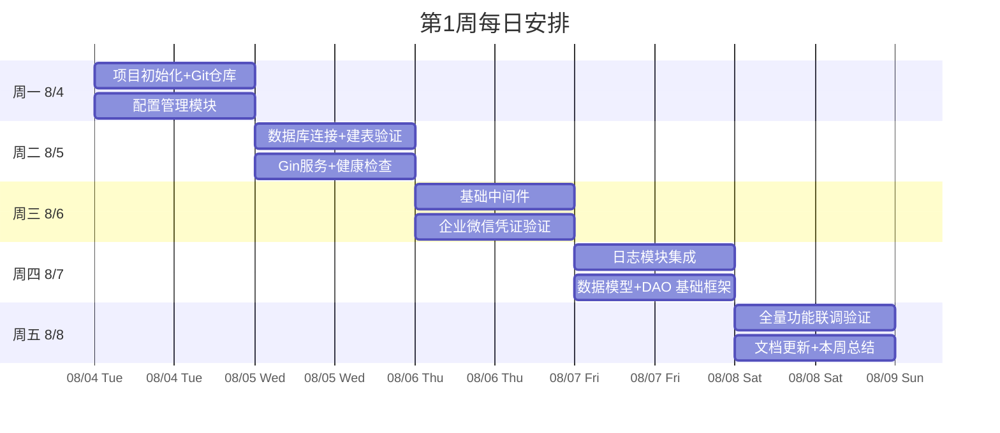

<!--
  文档名称：第1周（M1 基础设施）开发任务卡
  日期：2026-08-04 ~ 2026-08-08
  负责人：[技术负责人填入]
-->

# 第1周开发任务卡 — M1 基础设施

---

## 一、本周目标

完成项目脚手架搭建，确保以下能力就绪：
1. 后端能启动 HTTP 服务并返回健康检查
2. 数据库连接验证通过（SQL Server 2014）
3. 企业微信凭证验证通过
4. 基础中间件（日志、恢复）正常工作
5. 项目提交到 Git 仓库

---

## 二、任务分解

### 任务 1.1：项目仓库初始化（1h）

| 属性 | 内容 |
|------|------|
| 负责人 | TBD |
| 预估工时 | 1h |
| 前置依赖 | 无 |

**验收标准：**
- [ ] Git 仓库已初始化，`.gitignore` 正确配置
- [ ] Go 模块初始化 `go mod init hospital-qc-wework`
- [ ] 首次提交（initial commit）

**技术要点：**
- Git 分支策略：`main`（稳定）+ `develop`（开发）+ `feature/*`（特性分支）
- 提交信息规范：`[M1] xxx: 具体内容`

---

### 任务 1.2：配置管理模块（4h）

| 属性 | 内容 |
|------|------|
| 负责人 | TBD |
| 预估工时 | 4h |
| 前置依赖 | 无 |

**验收标准：**
- [ ] `config.yaml` 可正常加载
- [ ] 环境变量可覆盖配置（`DB_PASS`、`WEWORK_CORP_ID` 等）
- [ ] 无敏感信息硬编码
- [ ] 配置文件有合理默认值

**涉及文件：**
- `backend/config.yaml`
- `backend/internal/config/config.go`

**测试方法：**
```bash
# 验证配置加载
go run cmd/server/main.go --config config.yaml

# 验证环境变量覆盖
DB_PASS=test_pass WEWORK_CORP_ID=ww123 go run cmd/server/main.go --config config.yaml
```

---

### 任务 1.3：数据库连接池 + 建表验证（6h）

| 属性 | 内容 |
|------|------|
| 负责人 | TBD |
| 预估工时 | 6h |
| 前置依赖 | 任务 1.2、DBA 提供数据库连接信息 |

**验收标准：**
- [ ] 连接池初始化成功（`sqlx.Connect`）
- [ ] `db.Ping()` 返回无错误
- [ ] 连接池参数配置正确（MaxOpenConns=20, MaxIdleConns=5）
- [ ] SQL 建表脚本在目标数据库执行成功

**涉及文件：**
- `backend/internal/dao/db.go`
- `sql/001_schema.sql`
- `sql/002_init_data.sql`

**可能遇到的坑：**
| 问题 | 预期解决方案 |
|------|-------------|
| SQL Server 2014 不支持 `encrypt=true` | DSN 中设置 `encrypt=false` |
| `go-mssqldb` 驱动版本兼容 | 使用 `denisenkom/go-mssqldb` v0.12.x |
| 连接被防火墙阻止 | 确认 1433 端口开放 |

---

### 任务 1.4：Gin 服务 + 健康检查接口（3h）

| 属性 | 内容 |
|------|------|
| 负责人 | TBD |
| 预估工时 | 3h |
| 前置依赖 | 任务 1.2 |

**验收标准：**
- [ ] Gin 引擎初始化成功（debug/release 模式切换）
- [ ] `GET /api/v1/health` 返回 `{"code":0,"message":"ok","data":{"status":"ok","version":"1.0.0"}}`
- [ ] 服务端口可配置（默认 8080）
- [ ] 优雅关闭（SIGINT/SIGTERM）

**涉及文件：**
- `backend/cmd/server/main.go`
- `backend/internal/handler/routes.go`

**测试方法：**
```bash
go run cmd/server/main.go --config config.yaml &
curl http://localhost:8080/api/v1/health
# 预期输出: {"code":0,"message":"ok","data":{"status":"ok","version":"1.0.0"}}
```

---

### 任务 1.5：基础中间件（3h）

| 属性 | 内容 |
|------|------|
| 负责人 | TBD |
| 预估工时 | 3h |
| 前置依赖 | 任务 1.4 |

**验收标准：**
- [ ] `Recovery` 中间件能捕获 panic 并返回 500 错误
- [ ] `Logger` 中间件输出 JSON 格式日志（method, path, status, latency）
- [ ] 健康检查接口不记录日志（减少噪声）

**涉及文件：**
- `backend/internal/middleware/recovery.go`
- `backend/internal/middleware/logger.go`
- `backend/pkg/response/response.go`

---

### 任务 1.6：企业微信凭证验证（2h）

| 属性 | 内容 |
|------|------|
| 负责人 | TBD |
| 预估工时 | 2h |
| 前置依赖 | PM 提供 CorpID、AgentID、Secret |

**验收标准：**
- [ ] 能成功调用企业微信 `gettoken` 接口
- [ ] access_token 正确存入内存
- [ ] 验证失败时有明确错误日志

**涉及文件：**
- `backend/internal/service/push/token.go`

**测试方法：**
```bash
WEWORK_CORP_ID=wwxxx WEWORK_AGENT_ID=1000002 WEWORK_AGENT_SECRET=secret \
  go run cmd/server/main.go --config config.yaml
# 查看启动日志是否有 "access_token 刷新成功"
```

---

### 任务 1.7：日志模块集成（2h）

| 属性 | 内容 |
|------|------|
| 负责人 | TBD |
| 预估工时 | 2h |
| 前置依赖 | 任务 1.5 |

**验收标准：**
- [ ] zerolog 初始化完成，支持 JSON/text 格式切换
- [ ] 日志级别正常工作（debug/info/warn/error）
- [ ] 支持文件输出和标准输出两种模式
- [ ] 日志中包含时间戳（RFC3339）

**涉及文件：**
- `backend/cmd/server/main.go`（`initLogger` 函数）

---

## 三、本周交付物清单

| 交付物 | 类型 | 验收人 |
|--------|------|--------|
| 项目 Git 仓库（初次提交） | 代码 | 技术负责人 |
| 后端服务可启动 + 健康检查返回 200 | 功能 | 技术负责人 |
| 数据库连接验证通过 | 功能 | 技术负责人 |
| 企业微信凭证验证通过 | 功能 | 技术负责人 + PM |
| 建表脚本执行成功 | 脚本 | DBA |
| 项目模块分解文档更新（M1 进度） | 文档 | PM |

---

## 四、本周风险

| 风险 | 可能性 | 影响 | 应对 |
|------|--------|------|------|
| SQL Server 2014 驱动兼容问题 | 中 | 数据库连不上 | M1 第一天先用数据库工具验证可达性 |
| 企业微信凭证未按时到位 | 低 | 任务 1.6 阻塞 | 任务 1.6 排到周三，PM 承诺第1天到位 |
| 开发环境 Go 版本不一致 | 低 | 编译报错 | 统一使用 Go 1.22+，`go.mod` 固定版本 |

---

## 五、每日站会检查点



---

## 六、M1 完成检查清单

- [ ] 后端编译通过（`go build ./...`）
- [ ] 服务启动无错误日志
- [ ] `GET /api/v1/health` 返回 200
- [ ] 数据库建表脚本全部执行成功
- [ ] 企业微信 access_token 获取成功
- [ ] 日志格式正确（JSON 结构化）
- [ ] 项目模块分解文档已更新 M1 状态为「已完成」
- [ ] 风险登记册已更新
- [ ] 代码已提交到 Git
