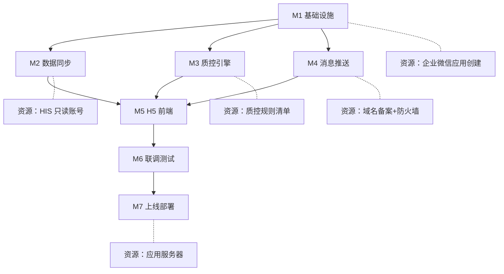
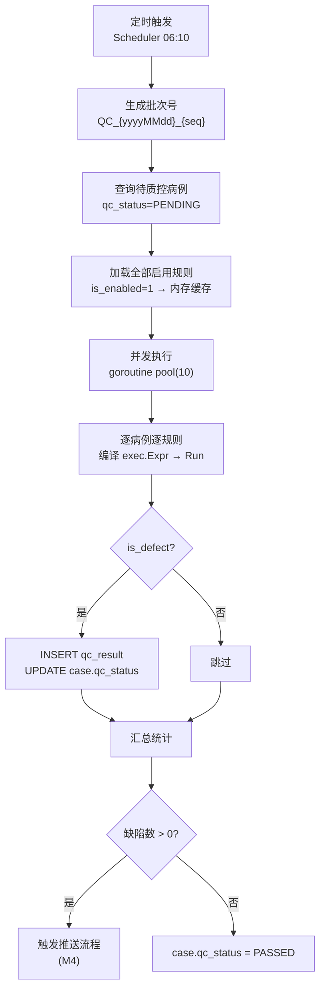
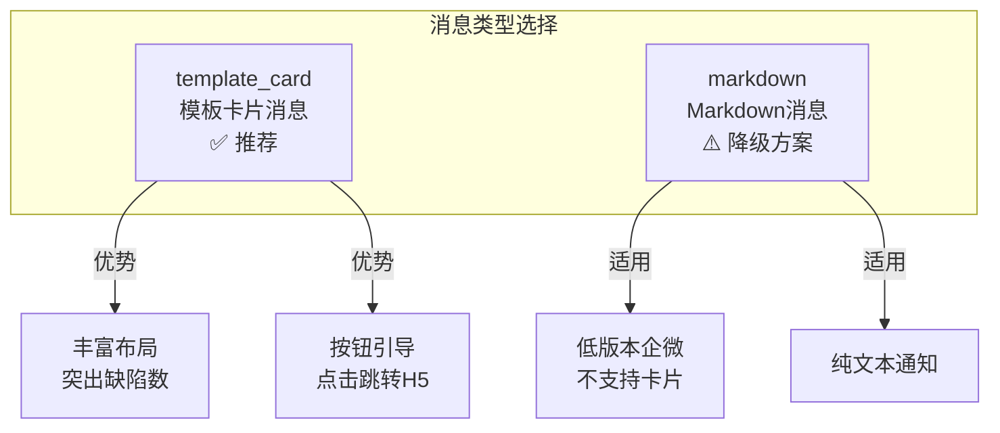
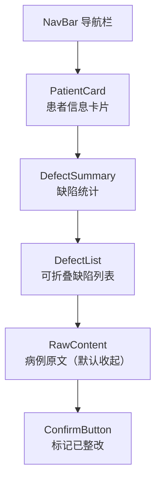
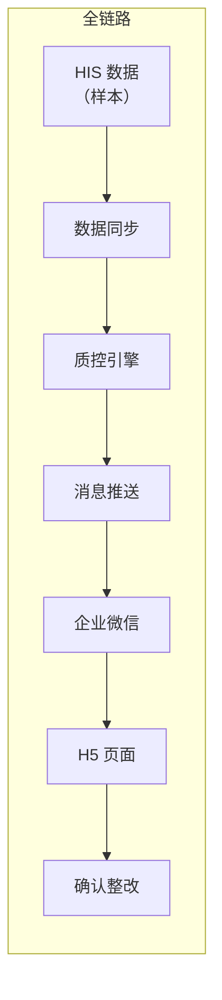
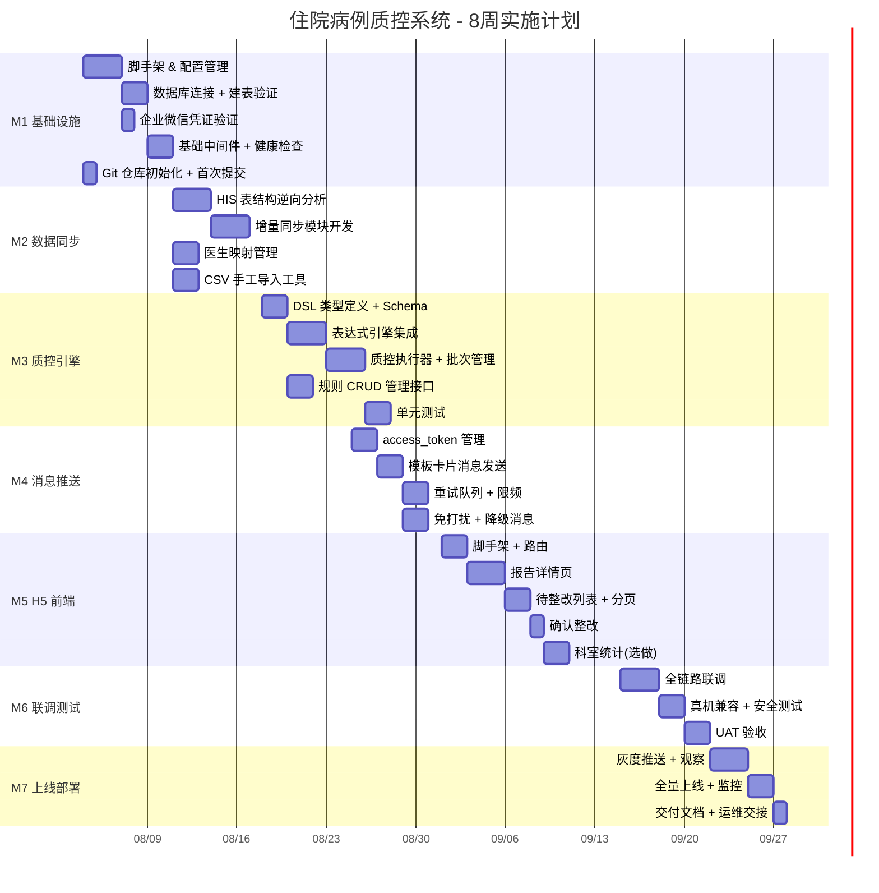
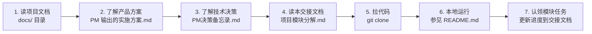

<!--
  文档名称：项目模块分解与交接文档（主控文档）
  版本：V2.4
  日期：2026-08-03
  维护人：[技术负责人]
  更新方式：每个模块有新进展/瓶颈/报错时立即更新对应章节
  GitHub：https://github.com/MIutopia/hospital-qc-wework
-->

# 住院病例质控企业微信推送系统 — 项目模块分解与交接文档

---

## 文档导航

| 章节 | 内容 | 最近更新 |
|------|------|---------|
| [一、项目总览](#一项目总览) | 项目背景、技术栈、GitHub 仓库 | 2026-07-31 |
| [二、模块分解总图](#二模块分解总图) | 全模块依赖关系与负责人 | 2026-07-31 |
| [三、模块详细说明](#三模块详细说明) | 各模块设计文档 + 进度状态 | 2026-07-31 |
| [四、接口与依赖矩阵](#四接口与依赖矩阵) | 模块间接口定义、外部依赖 | 2026-07-31 |
| [五、进度跟踪看板](#五进度跟踪看板) | 甘特图、里程碑、燃尽表 | 2026-07-31 |
| [六、风险登记册](#六风险登记册) | 已知风险、应对措施、状态 | 2026-07-31 |
| [七、交接清单](#七交接清单) | 新人上手需要了解的全部内容 | 2026-07-31 |

---

## 一、项目总览

### 1.1 一句话描述

住院病例质控系统自动从 HIS 同步病例数据，通过可配置的规则引擎检测病历缺陷，通过企业微信推送质控结果给责任医生，医生在 H5 页面查看报告并确认整改。

### 1.2 GitHub 仓库

```
远程仓库：https://github.com/MIutopia/hospital-qc-wework
默认分支：main（受保护）
协作方式：feature/* → Pull Request → main
提交规范：Conventional Commits（feat:/fix:/docs:/chore:）
任务跟踪：GitHub Issues + Project 看板
```

> **注意：** 不要直接 push 到 main 分支，所有变更必须通过 Pull Request。

### 1.3 技术栈

| 层 | 技术 | 版本 | 选型理由 |
|----|------|------|---------|
| 后端语言 | Go | 1.22+ | 单二进制部署零依赖，goroutine 并发模型 |
| Web 框架 | Gin | v1.10+ | 轻量高性能，社区活跃 |
| 数据库 | SQL Server | 2014 | 院方现有环境，无需额外采购 |
| 数据库驱动 | go-mssqldb + sqlx | - | SQL Server 2014 兼容性好 |
| 缓存 | Memurai 或进程内 MemoryCache | - | Windows 原生 Redis 兼容，可选 |
| 规则引擎 | expr-lang/expr | v1 | Go 原生表达式求值库 |
| 任务调度 | robfig/cron | v3 | 应用内调度，无需外部依赖 |
| JWT | golang-jwt/jwt | v5 | HMAC-SHA256 签名 |
| 日志 | zerolog | v1 | 零分配的结构化日志 |
| 前端框架 | Vue 3 + Composition API | 3.4+ | 企业微信 H5 标准实践 |
| UI 组件库 | Vant | 4.x | 移动端 H5 最佳选择 |
| 构建工具 | Vite | 5.x | 快速开发体验 |
| Web 服务器 | Nginx for Windows | 1.26+ | 反向代理 + 静态资源 |
| 部署 | NSSM + Windows Service | - | 注册为系统服务，开机自启 |

### 1.4 项目目录结构

```
hospital-qc-wework/
│
├── backend/                          # Go 后端
│   ├── cmd/server/main.go            # 入口：HTTP 服务 + 定时调度
│   ├── internal/
│   │   ├── config/config.go          # 配置管理（环境变量 + config.yaml）
│   │   ├── model/                    # 数据模型定义（结构体 + 表名映射）
│   │   │   ├── inpatient_case.go
│   │   │   ├── qc_rule.go
│   │   │   ├── qc_result.go
│   │   │   ├── doctor_wework.go
│   │   │   └── push_log.go
│   │   ├── dao/                      # 数据库访问层
│   │   │   ├── db.go                 # 连接池初始化
│   │   │   ├── case_dao.go
│   │   │   ├── rule_dao.go
│   │   │   ├── result_dao.go
│   │   │   ├── doctor_dao.go
│   │   │   └── push_log_dao.go
│   │   ├── middleware/               # HTTP 中间件
│   │   │   ├── auth.go               # JWT 鉴权
│   │   │   ├── logger.go             # 请求日志 + requestId
│   │   │   └── recovery.go           # panic 恢复
│   │   ├── handler/                  # HTTP 处理器
│   │   │   ├── report_handler.go     # /api/v1/report/*
│   │   │   ├── doctor_handler.go     # /api/v1/doctor/*
│   │   │   ├── dept_handler.go       # /api/v1/dept/*
│   │   │   └── admin_handler.go      # /api/v1/admin/*
│   │   └── service/                  # 业务逻辑层
│   │       ├── sync/sync_service.go  # 数据同步
│   │       ├── qc/
│   │       │   ├── engine.go         # 质控执行器
│   │       │   ├── dsl.go            # 规则 DSL 解析
│   │       │   └── rule.go           # 规则管理
│   │       ├── push/
│   │       │   ├── pusher.go         # 企业微信消息发送
│   │       │   ├── retry.go          # 重试队列
│   │       │   └── token.go          # access_token 管理
│   │       └── auth/
│   │           ├── jwt.go            # JWT 生成与验证
│   │           └── token.go          # 一次性 Token
│   ├── pkg/                          # 公共工具包
│   │   ├── response/response.go      # 统一响应格式
│   │   └── tokenbucket/bucket.go     # 令牌桶限频
│   ├── config.yaml                   # 默认配置文件
│   ├── go.mod
│   └── go.sum
│
├── frontend/                         # Vue 3 H5 前端
│   ├── src/
│   │   ├── views/
│   │   │   ├── ReportDetail.vue      # 质控报告详情页
│   │   │   ├── MyTasks.vue           # 我的待整改列表
│   │   │   ├── DeptStats.vue         # 科室统计（选做）
│   │   │   └── AuthError.vue         # 鉴权失败页
│   │   ├── components/
│   │   │   ├── PatientCard.vue       # 患者信息卡片
│   │   │   ├── DefectList.vue        # 缺陷列表（可折叠）
│   │   │   ├── RawContent.vue        # 病例原文（只读）
│   │   │   └── ConfirmButton.vue     # 确认整改按钮
│   │   ├── api/
│   │   │   └── index.ts             # API 封装
│   │   ├── router/index.ts          # 路由配置
│   │   └── utils/
│   │       ├── request.ts           # HTTP 请求工具
│   │       └── format.ts            # 格式化工具
│   ├── public/
│   ├── index.html
│   ├── vite.config.ts
│   ├── tsconfig.json
│   └── package.json
│
├── sql/                              # 数据库脚本
│   ├── 001_schema.sql                # 建表 DDL
│   ├── 002_init_data.sql             # 初始数据（科室、默认规则）
│   └── 003_seed.sql                  # 测试数据（脱敏样本）
│
├── deploy/                           # 部署配置
│   ├── nginx.conf                    # Nginx 反向代理配置
│   └── build.bat                     # Windows 构建脚本
│
├── docs/                             # 文档
│   ├── 项目模块分解与交接文档.md      # ← 你正在看的就是这个
│   ├── api.md                        # API 接口文档
│   └── deploy.md                     # 部署手册
│
├── .gitignore
└── README.md
```

---

## 二、模块分解总图

### 2.1 模块依赖关系



### 2.2 模块负责人（待分配）

| 模块 | 负责人 | 参与人 | 预计工时 |
|------|--------|--------|---------|
| M1 基础设施 | TBD | - | 第1周 |
| M2 数据同步 | TBD | - | 第2-3周 |
| M3 质控引擎 | TBD | - | 第3-4周 |
| M4 消息推送 | TBD | - | 第4-5周 |
| M5 H5 前端 | TBD | - | 第4-6周 |
| M6 联调测试 | TBD | TBD | 第7周 |
| M7 上线部署 | TBD | DBA | 第8周 |

> **说明：** 负责人由项目经理在团队组建后填入。M1 和 M5 可由不同人并行。

---

## 三、模块详细说明

---

### 模块 M1：基础设施

**预计工期：** 第1周（2026-08-04 ~ 2026-08-08）
**状态：** ✅ 已完成（2026-07-31）— 脚手架、集成增强、数据库/企微连通性验证、建表与初始数据全部就绪
**负责人：** TBD
**前置依赖：** 企业微信管理员权限（PM 已确认第1天到位）

#### 已完成工作（脚手架预搭建 + M1 集成增强）

在方案对齐阶段已提前完成以下可复用的代码框架，并在 2026-07-31 完成了 M1 集成增强：

| 交付物 | 状态 | 说明 |
|--------|------|------|
| Git 仓库初始化 + 远程 GitHub | ✅ 已完成 | MIutopia/hospital-qc-wework |
| Go 模块 + Gin 入口 | ✅ 已完成 | `cmd/server/main.go`，含优雅关闭 |
| 配置管理模块 | ✅ 已完成 | config.yaml + 环境变量覆盖 + 环境降级启动 |
| 统一响应格式 | ✅ 已完成 | pkg/response |
| 基础中间件（Recovery + Logger） | ✅ 已完成 | JSON 结构化日志，健康检查跳过日志 |
| JWT 鉴权中间件 | ✅ 已完成 | golang-jwt/v5 |
| 数据模型（7 张表 + HIS 宽表模型） | ✅ 已完成 | model/ 包 |
| DAO 层全表 CRUD | ✅ 已完成 | dao/ 包 |
| 质控引擎（DSL + expr + 并发执行器） | ✅ 已完成 | service/qc/ |
| 消息推送（access_token + 限频 + 重试） | ✅ 已完成 | service/push/ |
| JWT 鉴权服务 | ✅ 已完成 | service/auth/ |
| 管理接口 Handler | ✅ 已完成 | handler/ |
| 建表 SQL 脚本（DDL + 初始数据 + 测试数据） | ✅ 已完成 | sql/ |
| Nginx 配置 + 构建脚本 | ✅ 已完成 | deploy/ |
| API 文档 | ✅ 已完成 | docs/api.md |
| **🆕 Gin 模式切换** | ✅ 已完成 | debug/release/test 从 config.yaml 读取 |
| **🆕 企业微信 Token 管理器启动** | ✅ 已完成 | 启动时自动 RefreshLoop，无凭证时优雅降级 |
| **🆕 应用内定时任务调度** | ✅ 已完成 | 简易调度器（待网络恢复后替换为 robfig/cron） |
| **🆕 数据库降级启动** | ✅ 已完成 | 无 SQL Server 时服务仍可启动，健康检查报告状态 |
| **🆕 健康检查增强** | ✅ 已完成 | 返回 DB/Wework/ServerMode 等基础设施状态 |

#### M1 开发阶段仍需要做的工作

开发人员接手后，第1周需要完成以下**环境验证与调试**工作：

1. ✅ **本地全量编译测试** — `go build ./...` 已通过（33 个 Go 文件，2026-07-31 验证）
2. ✅ **服务可启动** — 降级模式下启动成功，健康检查返回正常（2026-07-31 验证）
3. ✅ **数据库连接验证** — 业务库 HospitalQC 与 HIS 数据仓库连接均成功（2026-07-31）
4. ✅ **建表脚本执行** — 已在 HospitalQC 库执行 001/002/003 脚本：7 张表 + 8 科室 + 10 规则 + 5 医生映射 + 5 病例全部就绪（2026-07-31，经新增工具 `cmd/dbsetup`）
5. ✅ **企业微信凭证验证** — access_token 获取成功（curl 直测 + 服务内 TokenManager 刷新均通过）
6. ✅ **日志格式验证** — JSON 结构化日志正常输出，健康检查接口不记录日志
7. ✅ **第1周集成增强** — Gin 模式切换、Token 管理器启动、定时调度器、优雅降级（2026-07-31 完成）

#### 阻塞项

| 阻塞项 | 影响任务 | 需要谁 | 预计解除 |
|--------|---------|--------|---------|
| SQL Server 2014 连接信息 | 任务 1.3 数据库连接验证 + 建表 | 院方信息科 | ✅ 已解除（2026-07-31 连接验证通过） |
| 企业微信 CorpID/AgentID/Secret | 任务 1.6 企微凭证验证 | PM | ✅ 已解除（2026-07-31 access_token 获取成功） |
| 网络代理（Go module proxy） | robfig/cron 依赖下载 | 院方网络 | 可暂时使用标准库调度器替代 |

#### 技术瓶颈 / 报错记录

| 日期 | 问题 | 原因 | 状态 | 解决方案 |
|------|------|------|------|---------|
| 2026-07-31 | 服务启动失败 `yaml: cannot unmarshal !!str ... into int` | config.yaml 中 `agent_id` 填为字符串，代码字段为 int | ✅ 已解决 | 去掉引号改为整数类型（真实值已脱敏） |
| 2026-07-31 | `hospital-qc.exe` 启动后数据库连接失败 `TLS Handshake failed: tls: server selected unsupported protocol version 301` | 旧 exe 为较早构建，DSN 使用 `encrypt=false` 仍触发 TLS 握手；SQL Server 2014 仅支持 TLS 1.0，Go 1.22 已不支持 | ✅ 已解决 | 源码 DSN 已改为 `encrypt=disable`（彻底禁用加密，内网单机部署无风险），重新 `go build -o hospital-qc.exe` |
| 2026-07-31 | 服务日志提示「企业微信凭证未配置」，尽管 config.yaml 已填 agent_secret | `WeWorkConfig.AgentSecret` yaml tag 为 `-`，仅从环境变量 `WEWORK_AGENT_SECRET` 读取 | ✅ 已解决 | 启动时注入环境变量 `WEWORK_AGENT_SECRET`，TokenManager 刷新 access_token 成功 |
| 2026-07-31 | 建表后**所有带 `?` 参数的查询**返回 500「查询失败」（分页接口、CSV 导入 Upsert、同步日志 OUTPUT 等） | go-mssqldb 驱动注册：`"mssql"` 名 = processQueryText=true（替换 `?` 占位符），`"sqlserver"` 名 = processQueryText=false（**不替换 `?`**），代码全用 `"sqlserver"` → SQL Server 收到字面 `?` 报 `mssql: "?"附近有语法错误` | ✅ 已解决 | **根因修复**：连接驱动名全部改为 `"mssql"`（dao/db.go、cmd/dbsetup）。此前按错误诊断内联的分页/TOP 整数已回退为标准 `?` 写法。`go test ./...` 通过；/admin/rules、/admin/doctors、/admin/sync/logs、CSV 导入实测全部正常 |

---

### 模块 M2：数据同步

**预计工期：** 第2-3周（2026-08-11 ~ 2026-08-22）
**状态：** ✅ 已完成（2026-08-03 确认：任务一（M1）与任务二（M2）全部完成，院方数据库 HospitalQC 及全部业务表已建立并投入使用）
**负责人：** TBD
**前置依赖：**
- [x] M1 基础设施完成
- [x] HIS 表结构文档（已从 HIS 数据仓库确认）
- [x] HIS 只读账号连接参数（已填写并验证通过，2026-07-31）
- [ ] 若 HIS 连接参数未到：先用 CSV 手工导入走阶段一（当前连接已通，不适用）

#### 阻塞项

| 阻塞项 | 影响任务 | 需要谁 | 预计解除 |
|--------|---------|--------|---------|
| 企微通讯录读取受「企业可信 IP」白名单限制（errcode=60020） | 任务 2.4 医生-企微映射（改为企微通讯录 API 直拉） | 企微管理员 / PM | 待后台加白部署服务器公网 IP 后复测 |
| 医生通讯录 CSV 未交付 | 任务 2.4（原方案） | 信息科 | 可绕过：解除 IP 白名单后改为 API 直拉 |

#### 技术方案要点（2026-07-31 更新：基于 HIS 数据仓库确认）

> **重大更新：** HIS 数据仓库（`[HIS数据库]` 库）表结构已确认，质控系统**直接读取数据仓库宽表**，不直连 SBO 源库。部署与数据库同服务器。

1. **数据源（已确认）**
   - 住院数据仓库：`[HIS数据库]` 库（**不使用财务库 `caiwu`**）
   - 病案首页：`hospitalisation_case_man`（含入院/出院时间、科室、医生、诊断、手术、病历质量）
   - 入院记录：`[HIS数据库]_hospitail_rceord`（主诉、现病史、体格检查）
   - 出院记录：`record_of_discharge`（出院诊断、治疗经过）
   - 病程记录：`hospital_course_record`（病案内容、记录医生）
   - 医嘱：`住院短期医嘱表` / `住院长期医嘱表`
   - 门诊：`records` 库 `out_medical_records`（预留）

2. **增量同步机制（复用现有）**
   - HIS 数据仓库已有 `SyncControl` 表记录同步进度
   - 各表均有 `录入时间`（`d_time_input`）时间戳字段用于增量识别
   - 质控系统通过 `录入时间 >= 上次同步点` 增量拉取
   - 同步范围：前一日新入院 + 新出院病例

3. **数据映射**
   - HIS 中文列名 → `inpatient_case` 表字段映射配置化（见 `sql/002_init_data.sql`）
   - 医生字段：`hospitalisation_case_man` 中主任/主治/住院医师 → 责任医生
   - 诊断字段：`西医初步诊断` / `门急诊西医诊断` → `diagnosis`

4. **医生-企业微信映射**
   - 优先从企微通讯录 API 直拉成员（2026-07-31 已备好工具 `cmd/weworkcontact`；需可信 IP 加白 + 通讯录读取权限）
   - 兜底：导入医生通讯录 CSV
   - 提供管理接口：`GET/POST /api/v1/admin/doctors`

> **待办：** 信息科需填写服务器 IP/密码（第二节连接参数）——见 [HIS 数据库连接信息确认表](docs/院方信息科-数据库信息需求表.md)

#### 交付物
- [x] HIS 数据同步模块（增量拉取，读 `[HIS数据库]` 宽表）— 2026-07-31 完成
- [x] CSV 手工导入工具（阶段一兜底）— 2026-07-31 完成
- [x] 医生-企业微信映射管理 CRUD — 脚手架已有
- [x] 同步日志记录（`sync_log` 表 + RUNNING/SUCCESS/FAILED 全流程记录 + `GET /admin/sync/logs` 查询）— 2026-07-31 完成
- [x] HIS 连接验证通过（2026-07-31，HIS 数据仓库连接 + Ping 成功）
- [x] 真实/样本数据同步联调（2026-08-03 确认完成：增量同步跑通、二次同步幂等、同步断点推进正常）

> **2026-07-31 已实现：**
> - `model/his_case.go`：HIS 宽表模型（英文 Go 字段 + 中文 db 标签）
> - `dao/his_dao.go`：HIS 增量查询（按「录入时间」断点）
> - `service/sync/sync_service.go`：增量同步 + 字段映射 + CSV 导入
> - `POST /api/v1/admin/sync`、`POST /api/v1/admin/sync/csv`

#### 技术瓶颈 / 报错记录

| 日期 | 问题 | 原因 | 状态 | 解决方案 |
|------|------|------|------|---------|
| 2026-07-31 | 企微通讯录拉取测试：`cmd/weworkcontact` 实测 `department/list`、`user/get` 均返回 `errcode=60020 not allow to access from your ip` | 企微应用配置了「企业可信 IP」白名单，开发机公网 IP 不在白名单内；凭证本身有效（access_token 获取成功） | ⏳ 待 PM 协调 | 企微管理后台「应用管理 → 应用 → 企业可信IP」添加部署服务器公网 IP；加白后在已加白机器上跑 `cmd/weworkcontact` 复测（详见 [给 PM 的阻碍协调报告](给PM的阻碍协调报告-2026-07-31.md)） |

---

### 模块 M3：质控引擎

**预计工期：** 第3-4周（2026-08-18 ~ 2026-08-29）
**状态：** ⏳ 进行中（2026-08-03：DSL 引擎修复完成，全部运算符单元测试通过；待接入首批业务规则清单）
**负责人：** TBD
**前置依赖：**
- [x] M1 基础设施完成
- [ ] 首批质控规则清单（PM 目标第2周末到位）
- [x] M2 数据同步（已有病例数据可质检）

#### 技术方案要点

1. **规则 DSL（JSON Schema 沿用产品方案）**

```json
{
  "ruleCode": "TIMELINESS_001",
  "ruleName": "入院记录24h内完成",
  "category": "TIMELINESS",
  "targetField": "admission_record.create_time",
  "operator": "HOURS_SINCE",
  "referenceField": "admit_time",
  "threshold": 24,
  "condition": "GREATER_THAN",
  "defectTemplate": "入院记录未在规定24h内完成，实际耗时 {actual} 小时",
  "suggestion": "请在患者入院24小时内完成入院记录书写"
}
```

2. **expr-lang/expr 解析**

```go
// 规则表达式编译示例
program, err := expr.Compile(ruleExpression, expr.Env(map[string]interface{}{
    "admit_time":       time.Time{},
    "admission_record": map[string]interface{}{},
    "discharge_time":   time.Time{},
    "diagnosis":        "",
    // ... 更多可用字段
}))
// 求值
output, err := expr.Run(program, env)
```

3. **支持的运算符映射**

| DSL operator | expr 实现（2026-08-03 修复后） |
|-------------|-----------|
| IS_NULL | `get(raw_data, "path") == nil` / 顶层字段 `field == nil` |
| IS_NOT_NULL | `get(...) != nil` / `field != nil` |
| EQUALS | `target == value`（字符串带引号） |
| NOT_EQUALS | `target != value` |
| GREATER_THAN | 有 referenceField：`after(target, reference)`；否则 `target > threshold` |
| LESS_THAN | 有 referenceField：`before(target, reference)`；否则 `target < threshold` |
| HOURS_SINCE | `hoursSince(reference, target) > threshold`（支持 time/字符串/缺失值） |
| DAYS_SINCE | `daysSince(reference, target) > threshold` |
| CONTAINS | `str(get(...)) contains "子串"`（expr 中缀运算符） |
| REGEX | `str(get(...)) matches "正则"`（expr 中缀运算符） |
| CROSS_CHECK | 多字段组合表达式（直接使用 condition） |

> **expr 修复说明（2026-08-03）：** expr v1.16.9 中 `contains`/`matches` 是**中缀运算符**而非函数（旧写法 `contains(x,y)` 无法编译）；expr 对 map 二级以上路径在键缺失时直接运行报错，故 `raw_data.*` 一律经自定义 `get(raw_data, "path")` 安全取值（缺失返回 nil）；`hoursSince` 在目标字段缺失时返回 +Inf，使「N小时内未完成」类规则在文书缺失时正确命中缺陷。

4. **质控执行流程**



5. **规则热更新**
   - 每次质控任务启动时重新从 `qc_rule` 表加载全量启用规则到内存
   - 后续迭代可引入 Redis Pub/Sub 做缓存失效
   - 无需重启服务

#### 交付物
- [x] 规则 DSL 类型定义（`model.RuleDSL` + JSON Schema 沿用产品方案）
- [x] expr-lang/expr 解析引擎集成（`service/qc/dsl.go`：get/str/num 安全取值 + before/after + hoursSince/daysSince）
- [x] 质控执行器（并发批次执行，`service/qc/engine.go`：raw_data JSON 解析修复）
- [x] 规则 CRUD 管理接口（`GET/POST/PUT/DELETE /api/v1/admin/rules`）
- [x] 单元测试（覆盖 IS_NULL/IS_NOT_NULL/EQUALS/NOT_EQUALS/GREATER_THAN/LESS_THAN/HOURS_SINCE/DAYS_SINCE/CONTAINS/REGEX/CROSS_CHECK 共 11 类，`go test ./...` 通过）
- [ ] 首批业务质控规则清单确认（PM 目标第2周末，当前使用 sql/002 中 10 条示例规则联调）

#### 技术瓶颈 / 报错记录

| 日期 | 问题 | 原因 | 状态 | 解决方案 |
|------|------|------|------|---------|
| 2026-08-03 | `contains(x, y)` / `matches(x, y)` 函数写法编译失败 | expr v1.16.9 将 contains/matches 定义为**中缀运算符**，函数调用语法不被识别 | ✅ 已解决 | 生成 `str(field) contains "x"` / `str(field) matches "re"` 中缀写法；移除自定义 contains/matches 函数注册 |
| 2026-08-03 | 含 `raw_data.*` 的规则在字段缺失时运行报错 `cannot fetch x from <nil>`，导致 IS_NULL/完整性规则不生效 | expr 对 map 二级以上路径在键缺失时直接抛错；engine 中 raw_data 未做 JSON 解析（占位注释） | ✅ 已解决 | 新增 `get(raw_data, "a.b.c")` 安全取值（缺失返回 nil）；engine 的 `buildEnv` 真实执行 `json.Unmarshal(raw_data)` |
| 2026-08-03 | 出院时间早于入院时间规则（LOGIC_001）编译/求值失败 | `threshold=null` 生成 `discharge_time < 0` 类型不匹配；且 `nil < time.Time` 运行报错 | ✅ 已解决 | LESS_THAN/GREATER_THAN 检测到 referenceField 时改用 `before(a,b)`/`after(a,b)`（nil 安全），时间比较不再走字面量阈值 |
| 2026-08-03 | HOURS_SINCE 对 raw_data 中的字符串时间无法计算 | 入院记录 create_time 以字符串 "2006-01-02 15:04:05" 存储，旧 hoursSince 仅接受 time.Time | ✅ 已解决 | `toTime` 兼容 time.Time / *time.Time / 6 种字符串格式；目标缺失返回 +Inf 命中超时缺陷 |

---

### 模块 M4：消息推送

**预计工期：** 第4-5周（2026-08-25 ~ 2026-09-05）
**状态：** ⏳ 进行中（2026-08-03：推送服务接线完成 — PushService/Pusher/令牌桶/免打扰/推送日志已实现；待企微可信 IP 加白后真机联调）
**负责人：** TBD
**前置依赖：**
- [x] M1 基础设施完成（企业微信 API Client + TokenManager）
- [x] 医生-企微映射管理（CRUD + CSV 兜底可用；API 直拉待 IP 加白）
- [ ] 域名备案 + HTTPS 证书（PM 目标第2周末到位）
- [ ] 防火墙白名单（PM 目标第3周末到位）

#### 技术方案要点

1. **access_token 多级缓存**

```
进程内存 (sync.Map)  ← 第一级：0ms 延迟
    ↑↓ 降级
Memurai / MemoryCache  ← 第二级：进程重启兜底
    ↑
企业微信 API           ← 定时刷新（每 3500s）
```

2. **推送限频（令牌桶）**

```go
// 配置：10次/秒，桶容量 100
// 每 100ms 批量取出 5-10 条发送
// 缓冲队列容量 2000（channel）
// 队列满则告警，不丢弃
```

3. **消息类型**



4. **重试策略**

| 重试次数 | 延迟 | 说明 |
|---------|------|------|
| 0 | 立即 | 首次发送 |
| 1 | 1分钟 | 网络抖动 |
| 2 | 5分钟 | 临时限频 |
| 3 | 15分钟 | 企微API波动 |
| 4 | 30分钟 | 持续失败 → status=FAILED 人工介入 |

5. **免打扰时段**
   - 配置项：`QUIET_START=22:00`, `QUIET_END=08:00`
   - 推送时判断当前时间是否在免打扰窗口
   - 在窗口内：写入 `push_log` 但 `push_status=DEFERRED`，窗口结束后自动发送

#### 交付物
- [x] access_token 管理模块（TokenManager 内存缓存 + 3500s 定时刷新）
- [x] 模板卡片消息发送（`service/push/pusher.go`，跳转 H5 URL 使用 `h5.base_url`）
- [x] 推送编排服务（`service/push/push_service.go`：聚合缺陷 → 医生映射 → H5 token → 限频发送 → 日志）
- [x] 失败重试队列（`service/push/retry.go` 指数退避 1m→5m→15m→30m；FAILED 记录由定时推送自动重试）
- [x] 令牌桶限频控制（`pkg/tokenbucket`，10次/秒 容量100）
- [x] 免打扰时段过滤（22:00-08:00 → push_status=DEFERRED，含跨午夜判定与单元测试）
- [x] 推送日志 + 状态追踪（push_log 表 SUCCESS/FAILED/DEFERRED + `GET /admin/push/logs`）
- [x] 定时任务接线（06:10 质控 → 自动推送；06:30 定时推送；`cmd/server/main.go`）
- [ ] markdown 降级消息（企微低版本兼容，后续迭代）
- [ ] 真机联调（待企微可信 IP 加白）

#### 技术瓶颈 / 报错记录

| 日期 | 问题 | 原因 | 状态 | 解决方案 |
|------|------|------|------|---------|
| - | - | - | - | - |

---

### 模块 M5：H5 前端

**预计工期：** 第4-6周（2026-09-01 ~ 2026-09-12）
**状态：** ⏳ 待开始
**负责人：** TBD
**前置依赖：**
- [ ] 后端 API 接口定义就绪（M1 已定义 Swagger）
- [ ] 设计稿确认（如有）

#### 技术方案要点

1. **页面路由**

| 路由 | 页面 | 说明 |
|------|------|------|
| `/report?caseId=&token=` | 质控报告详情页 | 企业微信卡片进入 |
| `/my-tasks` | 我的待整改 | 医生查看自己全部待整改 |
| `/stats` | 科室统计（选做） | 科主任视角 |
| `/auth-error` | 鉴权失败 | Token 过期/无效 |

2. **报告详情页结构**



3. **Vant 组件使用**
   - `NavBar` — 顶部导航
   - `Card` — 患者信息卡片
   - `Collapse` — 缺陷列表折叠
   - `Tag` — 缺陷等级标签（A=红/B=橙/C=黄）
   - `Button` — 确认整改
   - `PullRefresh` + `List` — 分页加载

4. **企业微信兼容**
   - 企业微信内置浏览器（iOS WKWebView / Android X5）
   - 调用 `wx.config` 做 JSSDK 签名（如需原生能力）
   - 注意 iOS 键盘遮挡、页面回退等问题

#### 交付物
- [ ] 项目脚手架（Vite + Vue 3 + Vant + TypeScript）
- [ ] 路由配置
- [ ] 报告详情页（核心页面）
- [ ] 待整改列表页（分页）
- [ ] 确认整改交互
- [ ] 鉴权失败页
- [ ] 科室统计页（选做）

#### 技术瓶颈 / 报错记录

| 日期 | 问题 | 原因 | 状态 | 解决方案 |
|------|------|------|------|---------|
| - | - | - | - | - |

---

### 模块 M6：联调测试

**预计工期：** 第7周（2026-09-15 ~ 2026-09-19）
**状态：** ⏳ 待开始
**负责人：** TBD

#### 测试范围



#### 测试类型
- [ ] **单元测试**：规则引擎（8 种运算符各至少 1 条用例）
- [ ] **集成测试**：DAO 层 CRUD 验证
- [ ] **全链路联调**：样本数据走通 HIS → 确认整改完整链路
- [ ] **企业微信真机测试**：iOS + Android 各覆盖
- [ ] **安全测试**：JWT 伪造、SQL 注入、Token 越权
- [ ] **UAT 验收**：质控科操作验收

#### 技术瓶颈 / 报错记录

| 日期 | 问题 | 原因 | 状态 | 解决方案 |
|------|------|------|------|---------|
| - | - | - | - | - |

---

### 模块 M7：上线部署

**预计工期：** 第8周（2026-09-22 ~ 2026-09-26）
**状态：** ⏳ 待开始
**负责人：** TBD

#### 部署架构（单机 — 院方要求应用与数据库同服务器）

```mermaid
graph TD
    subgraph 单机 "[院方服务器]（SQL Server 2014 服务器，应用同机部署）"
        HIS[("HIS 数据仓库<br/>[HIS数据库] / records / caiwu")]
        DB[("业务数据库<br/>HospitalQC")]
        APP["后端进程<br/>hospital-qc.exe :8080"]
        NGX["Nginx for Windows"]
        MEM["Memurai :6379"]
    end

    subgraph 公网
        WX["企业微信 API"]
    end

    APP -->|本机连接| DB
    APP -->|本机只读| HIS
    APP -->|缓存| MEM
    NGX -->|本机反代| APP
    NGX -->|HTTPS 出站| WX
```

> **部署说明（2026-07-31 更新）：**
> - 后端、Nginx、HIS 数据仓库、HospitalQC 数据库**全部在同一台服务器** `[院方服务器]`
> - 数据库连接使用 `localhost`，无需跨服务器防火墙
> - IP 地址与密码由院方人员部署时手动填写

#### 上线步骤

```
第8周 周一   灰度推送：选取 1 个科室（20% 医生）推送
第8周 周二   观察推送成功率 + 医生反馈
第8周 周三   无问题 → 全量推送
第8周 周四   监控稳定 → 正式上线
第8周 周五   交付文档 + 运维交接
```

#### 技术瓶颈 / 报错记录

| 日期 | 问题 | 原因 | 状态 | 解决方案 |
|------|------|------|------|---------|
| - | - | - | - | - |

---

## 四、接口与依赖矩阵

### 4.1 模块间接口

| 接口方向 | 来源模块 | 目标模块 | 接口形式 | 说明 |
|---------|---------|---------|---------|------|
| 数据同步→质控 | M2 | M3 | 数据库表 `inpatient_case` | M2 写入病例，M3 读取质检 |
| 质控→推送 | M3 | M4 | 数据库表 `qc_result` | M3 写入结果，M4 读取推送 |
| 推送→前端 | M4 | M5 | REST API | 消息卡片中的 H5 URL |
| 前端→后端 | M5 | M1 | REST API | 报告详情、确认整改 |
| 管理→后端 | M5 | M1 | REST API | 规则 CRUD、手动触发 |

### 4.2 外部依赖

| 依赖 | 用途 | 状态 | 责任人 |
|------|------|------|--------|
| HIS 数据仓库表结构 | 数据同步 | ✅ 已确认（`[HIS数据库]`/`records`/`caiwu` 三库宽表） | 信息科 |
| HIS 数据库连接参数（IP/密码） | 数据同步 | ✅ 已填写并验证通过（2026-07-31） | 信息科 |
| 企业微信 CorpID/Secret | 消息推送 | ✅ 已到位并验证通过（access_token 获取成功） | PM |
| 域名备案 + HTTPS | H5 页面 | ⏳ 备案中（1-2周） | PM |
| 防火墙白名单 | 出站到企微 API | ⏳ 第3周前 | PM |
| Windows Server（与数据库同机） | 部署 | ✅ 确认单机部署（`[院方服务器]`） | 院方 |
| SQL Server 2014 连接信息 | 数据库 | ✅ 院方现有（同机 `localhost`） | 信息科 |
| 医生通讯录 CSV | 医生映射 | ⏳ 第1-2周导出（可绕过：企微通讯录 API 直拉，需可信 IP 加白） | 信息科 |
| 企微通讯录读取权限（可信 IP + 读取成员） | 医生映射 | ⏳ 待企微管理员配置 | 企微管理员 / PM |
| 脱敏病例样本（10-20份） | 开发调试 | ⏳ 第2周 | 信息科 |

### 4.3 REST API 一览

| 方法 | 路径 | 模块 | 鉴权 | 说明 |
|------|------|------|------|------|
| GET | `/api/v1/health` | M1 | 无 | 健康检查 |
| GET | `/api/v1/report/detail` | M1 | JWT | 质控报告详情 |
| POST | `/api/v1/report/confirm` | M1 | JWT | 确认整改 |
| GET | `/api/v1/doctor/tasks` | M1 | JWT | 待整改列表 |
| GET | `/api/v1/dept/stats` | M1 | JWT | 科室统计 |
| GET/POST | `/api/v1/admin/rules` | M3 | 管理员 | 规则 CRUD |
| POST | `/api/v1/admin/sync` | M2 | 管理员 | 手动触发同步 |
| POST | `/api/v1/admin/qc/run` | M3 | 管理员 | 手动触发质控 |
| GET | `/api/v1/admin/push/logs` | M4 | 管理员 | 推送日志查询 |
| GET/POST | `/api/v1/admin/doctors` | M2 | 管理员 | 医生映射管理 |

---

## 五、进度跟踪看板

### 5.1 甘特图



### 5.2 里程碑状态

| 里程碑 | 计划日期 | 状态 | 实际完成 | 备注 |
|--------|---------|------|---------|------|
| M1 基础设施完成 | 第1周末 | ✅ 已完成 | 2026-07-31 | 脚手架+集成增强+连通性验证+建表全部就绪；`go build`/`go test` 通过 |
| M2 数据同步完成 | 第3周末 | ⏳ 待开始 | - | 依赖 HIS 账号 |
| M3 质控引擎完成 | 第4周末 | ⏳ 待开始 | - | 引擎代码已预搭建，需联调 |
| M4 消息推送完成 | 第5周末 | ⏳ 待开始 | - | 推送代码已预搭建，需联调 |
| M5 H5 前端完成 | 第6周末 | ⏳ 待开始 | - | 前端脚手架未搭建 |
| M6 联调通过 | 第7周末 | ⏳ 待开始 | - | - |
| M7 正式上线 | 第8周末 | ⏳ 待开始 | - | - |

---

## 六、风险登记册

| 编号 | 风险描述 | 概率 | 影响 | 等级 | 应对措施 | 责任人 | 状态 |
|------|---------|------|------|------|---------|--------|------|
| R01 | HIS 表结构不明，数据同步阻塞 | 低 | 高 | 🟢 | ✅ 表结构已确认（HIS 数据仓库宽表），连接参数已验证通过（2026-07-31） | 信息科 | ✅ 已解除 |
| R02 | 企业微信 API 限频导致推送延迟 | 中 | 中 | 🟡 | 令牌桶限频（10次/秒）+ 本地缓冲队列 | 后端 | ⏳ 待处理 |
| R03 | 质控规则不完整/不准确 | 高 | 高 | 🔴 | M3 前与质控科逐条确认，先上 10-15 条核心规则 | PM | ⏳ 待处理 |
| R04 | 医生企微账号未全覆盖 | 中 | 中 | 🟡 | 提供未覆盖清单给管理员，记录日志 | 后端+PM | ⏳ 待处理 |
| R05 | H5 企业微信内置浏览器兼容问题 | 低 | 中 | 🟢 | 提前开发者工具+真机测试，准备降级方案 | 前端 | ⏳ 待处理 |
| R06 | Go 团队经验不足 | 中 | 中 | 🟡 | M1 出设计评审 + 代码 Review 机制 | 技术负责人 | ⏳ 待处理 |
| R07 | SQL Server 2014 兼容坑 | 中 | 中 | 🟡 | M1 就用样本数据跑通全链路，提前发现问题 | 后端 | ⏳ 待处理 |
| R08 | 域名备案延迟 | 中 | 高 | 🟡 | M4 联调前完成即可，不影响 M1-M3 开发 | PM | ⏳ 推进中 |
| R09 | 企微通讯录拉取受「可信 IP」白名单限制（60020），医生-企微映射无法建立 | 高 | 高 | 🔴 | PM 协调企微管理员加白部署服务器公网 IP + 确认「读取成员」权限；工具 `cmd/weworkcontact` 已就绪，加白后复测 | PM+后端 | ⏳ 待处理 |

---

## 七、交接清单

### 7.1 新人上手步骤



### 7.2 关键文档索引

| 文档 | 位置 | 说明 |
|------|------|------|
| 产品实施方案 | `outputs/实施方案-住院病例质控企业微信推送系统.md` | 需求定义、DB设计、API设计（PM 原始方案） |
| PM决策备忘录 | `outputs/PM决策备忘录-技术方案对齐.md` | 5项技术决策记录 |
| 技术可行性分析 | `outputs/技术可行性分析报告-住院病例质控企业微信推送系统.md` | 技术选型论证 |
| **技术方案终稿** | `docs/技术方案终稿-统一Go+Windows原生.md` | ✅ **技术方案最终版本，以此为准** |
| **本项目交接文档** | `docs/项目模块分解与交接文档.md` | ← **当前文档** |
| **第1周开发任务卡** | `docs/第1周开发任务卡.md` | M1 开发阶段的任务分解 |
| **第2周开发任务卡** | `docs/第2周开发任务卡.md` | M2 数据同步的任务分解（2026-07-31 新增） |
| API接口文档 | `docs/api.md` | 全部接口定义（已输出） |
| 部署手册 | `docs/deploy.md` | 部署步骤（M7输出） |
| HIS 数据库信息需求表 | `docs/院方信息科-数据库信息需求表.md` | 📋 交给信息科填写的 HIS 数据库接入需求清单 |
| **给 PM 的阻碍协调报告** | `docs/给PM的阻碍协调报告-2026-07-31.md` | 📋 当前阻碍、需 PM/院方协调事项、执行顺序重排建议（2026-07-31） |

### 7.3 常用命令

```bash
# 后端启动（开发）
cd backend
go run cmd/server/main.go --config config.yaml

# 构建 Windows 可执行文件
cd backend
go build -o hospital-qc.exe cmd/server/main.go

# 注册 Windows Service
nssm install HospitalQC "D:\app\hospital-qc.exe"

# 前端启动（开发）
cd frontend
npm install
npm run dev

# 前端构建
cd frontend
npm run build
```

### 7.4 环境变量清单（敏感信息）

| 变量名 | 说明 | 配置时机 |
|--------|------|---------|
| `DB_PASS` | 业务数据库密码（也可直接在 config.yaml 填写） | 部署时 |
| `HIS_DB_PASS` | HIS 只读密码（也可直接在 config.yaml 填写） | 部署时 |
| `HIS_DB_USER` | HIS 只读账号（也可直接在 config.yaml 填写） | 部署时 |
| `WEWORK_CORP_ID` | 企业 CorpID | 第1天 |
| `WEWORK_AGENT_ID` | 应用 AgentID | 第1天 |
| `WEWORK_AGENT_SECRET` | 应用 Secret | 第1天 |
| `JWT_SECRET` | JWT 签名密钥 | 部署时生成 |
| `H5_BASE_URL` | H5 页面域名 | 域名备案后 |

> **院方部署说明：** 数据库连接信息（server/port/name/user/password）由院方技术人员**直接在 `config.yaml` 中填写**。
> SQL Server 身份验证，`encrypt=false`（不加密）。环境变量优先级高于配置文件。

---

## 八、更新日志

| 日期 | 更新人 | 更新内容 |
|------|--------|---------|
| 2026-07-31 | 技术负责人 | V1.0 初稿：全模块分解、接口矩阵、风险登记册 |
| 2026-07-31 | 技术负责人 | V1.1 更新：M1 脚手架已完成状态、GitHub 仓库信息、新增文档索引 |
| 2026-07-31 | 技术负责人 | V1.2 更新：新增「HIS 数据库信息需求表」文档，供信息科填写数据库接入信息 |
| 2026-07-31 | 技术负责人 | V1.3 更新：确认 HIS 数据仓库表结构（[HIS数据库] 宽表），M2 改读数据仓库；部署改为单机（应用与数据库同服务器）|
| 2026-07-31 | 技术负责人 | V1.4 更新：M2 数据同步代码完成（his_case/his_dao/sync_service + sync/csv 接口）；连接信息改为院方直接填写 config.yaml（SQL Server 验证，不加密）|
| 2026-07-31 | 技术负责人 | V1.5 更新：M1 集成增强完成 — Gin 模式切换、WeWork TokenManager 启动+RefreshLoop、应用内定时调度器（标准库）、数据库降级启动、健康检查增强（db/wework/mode 状态）。`go build ./...` 编译通过，服务可降级启动并返回健康检查 200 |
| 2026-07-31 | 技术负责人 | V1.6 更新：数据库与企微连通性验证通过 — 业务库 HospitalQC + HIS 数据仓库连接成功，企微 access_token 获取成功（curl 直测 + 服务内 TokenManager 刷新）。修复：`agent_id` 配置类型（字符串→整数）；旧 exe 的 `encrypt=false` 触发 TLS 1.0 握手失败，源码 DSN 已用 `encrypt=disable` 解决并重新编译；企微 secret 需经 `WEWORK_AGENT_SECRET` 环境变量注入（config.yaml 的 agent_secret 字段被 `yaml:"-"` 忽略）|
| 2026-07-31 | 技术负责人 | V1.7 更新：HospitalQC 建表脚本执行完成 — 新增 `cmd/dbsetup` 建表工具（go-mssqldb，自动拆分 GO 批次），执行 sql/001-003 全部成功：7 张表 + 初始科室/规则 + 脱敏种子数据就绪 |
| 2026-07-31 | 技术负责人 | V1.8 更新：分页接口 500 排查（当时以内联整数临时规避，后经 V2.0 定位真实根因为驱动名，内联已回退）；建表后实测 /admin/rules(10)、/admin/doctors(5) 返回正常；HIS 同步查询在数据仓库复现成功（两表 TOP5 各 5 行），M2 同步链路就绪 |
| 2026-07-31 | 技术负责人 | V1.9 更新：M1 基础设施阶段完成 — 逐项核对第1周任务卡全部验收通过（编译/启动/健康检查/建表/企微/中间件/日志），M1 状态标记「已完成」，风险登记册 R01 解除 |
| 2026-07-31 | 技术负责人 | V2.0 更新：M2 推进 — 定位并修复 `?` 占位符失效根因（驱动名 `"sqlserver"` 不处理 `?`，全部改用 `"mssql"`，回退此前错误的分页内联）；实现同步日志（sync_log 表/模型/DAO/服务内 RUNNING→SUCCESS/FAILED 记录/管理查询接口）；修复 CSV 兜底在 HIS 未连时不生效；CSV 导入 + 同步日志端到端验证通过并清理测试数据 |
| 2026-07-31 | 技术负责人 | V2.1 更新：企微通讯录拉取受阻定位 — 新增测试工具 `cmd/weworkcontact`（枚举部门/成员、拉指定成员，输出脱敏）；实测 `department/list`、`user/get` 均返回 `errcode=60020`（可信 IP 白名单拦截），凭证有效（access_token 获取成功）；医生映射改为「企微 API 直拉优先、CSV 兜底」；新增 M2 阻塞项、外部依赖「企微通讯录读取权限」、风险 R09；产出 [给 PM 的阻碍协调报告](给PM的阻碍协调报告-2026-07-31.md) |
| 2026-08-03 | 技术负责人 | V2.2 更新：M3 质控引擎修复完成 — 定位并修复 expr 引擎 4 处根因（contains/matches 中缀语法、map 深层缺失报错、referenceField 时间比较、hoursSince 字符串时间）；engine 补 raw_data JSON 解析；单元测试覆盖 11 类运算符（`go test ./...` 通过）。M2 状态标记「已完成」（院方数据库 HospitalQC 及业务表已建立） |
| 2026-08-03 | 技术负责人 | V2.3 更新：M3/M4 推进 — 新增 `internal/app` 装配层（集中管理 DAO/服务）；定时调度器接入真实任务（HIS 同步 23:00 / 质控 06:10 / 推送 06:30）；M4 推送服务接线（PushService + Pusher 重构 + 推送日志 OUTPUT INSERTED.id 修复 + 免打扰单元测试）；H5 后端接口补全（确认整改 qc_confirm、科室统计 dept/stats）；配置新增 `h5.base_url`（H5_BASE_URL）；降级模式冒烟测试通过 |
| 2026-08-03 | 技术负责人 | V2.4 更新：新增核心约束「文档同步」— 每次更新/新增项目源码后必须同步更新本文档（模块状态/交付物/技术瓶颈/更新日志）与对应任务卡、`docs/api.md`；约束已写入 CLAUDE.md 核心约束章节 |
| 2026-08-03 | 技术负责人 | V2.5 更新：GitHub Issue 看板建立 — 里程碑「8周实施计划 (M1-M7)」+ 15 个标签（M1~M7 模块/状态/优先级）+ 13 个任务 Issue（#7-#19，含 3 个已完成记录与 4 个外部依赖/阻塞项）；看板入口见 README「GitHub 协作与看板」 |

---

> **维护说明：**
> 1. 每个模块开工时，在「状态」行填入负责人和实际开工日期
> 2. 遇到技术瓶颈或报错，立即写入对应模块的「技术瓶颈/报错记录」表
> 3. 每周五更新「进度跟踪看板」中的里程碑状态
> 4. 发现新风险，填入「风险登记册」
> 5. 有新人加入，告知阅读本文档 + 产品方案 + PM决策备忘录
> 6. **每次更新或新增项目源码内容后，必须同步更新本文档对应模块的「状态」「交付物」「技术瓶颈/报错记录」并在「八、更新日志」追加记录（核心约束，2026-08-03 新增，见 CLAUDE.md）**
